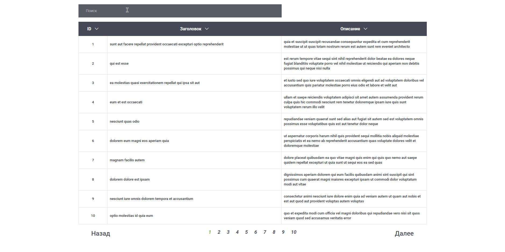

# HH React Posts
Посмотреть функционал можно по [ссылке](https://hh-react-posts.vercel.app)

## Описание проекта

Проект hh-react-posts представляет собой красиво оформленную страницу, отображающую посты в табличном виде. Вот ключевые особенности проекта:

### Табличный вид

- Используется красивая верстка страницы в табличном виде.
- Каждая строка таблицы содержит уникальный id, заголовок поста и его описание.

### Навигация и пагинация

- Присутствуют страницы для удобного разделения постов.
- Реализована пагинация для навигации между страницами.

### Поиск и сортировка

- Красивый input предоставляет возможность проводить поиск по заголовкам постов.
- Возможность сортировать по заголовкам и другим столбцам таблицы.

### Кастомные хуки и работа с API

- Написаны кастомные хуки для эффективного управления состоянием компонентов.
- Идет работа с API для получения данных и обновления таблицы в реальном времени.

## Установка и запуск проекта

1. Склонируйте репозиторий на свой локальный компьютер.
2. Установите зависимости с помощью команды `npm install`.
3. Запустите проект с помощью команды `npm start`.
4. Откройте приложение в браузере по адресу `http://localhost:3000`.

## Дополнительная информация

Для подробной информации о проекте и его компонентах обращайтесь к документации и комментариям в исходном коде.

## Связь:
- Telegram: https://t.me/LeylinV
- GitHub: https://github.com/LeylinV